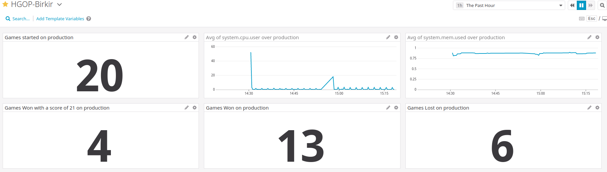

# HGOP-Birkir

## Week 1 hand-in
Link to running API on AWS: 3.85.142.183:3000/status

## Week 2 hand-in
URL to running jenkins instance: http://ec2-34-201-166-31.compute-1.amazonaws.com:8080

## Week 3 hand-in

URL to running Jenkins instance http://ec2-34-201-166-31.compute-1.amazonaws.com:8080

URL to screenboard (I also invited Hrafn as a team member to be safe) https://app.datadoghq.eu/dashboard/ku7-tw6-9zs/hgop-birkir?from_ts=1576247024692&to_ts=1576250624692&live=true&tile_size=m

Screenshot of DataDog dashboard

